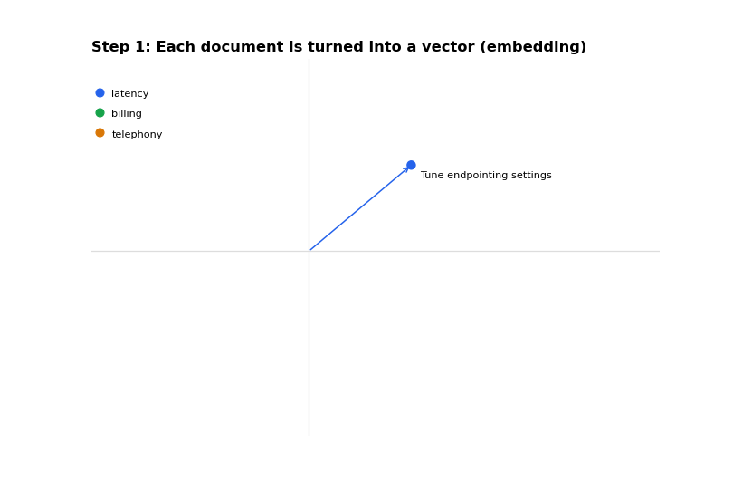

1. **What is a Large Language Model?**
   
   A neural network(transformer) trained on huge amounts of text to predict the next token. Everything it does, from chat
   to tool calls, comes from that one skill applied repeatedly. 
2. **What is a token?**
   
   A token is a chunk of text, roughly 3-4 characters in English. Pricing, context limits, and latency all scale with tokens, so a bloated
   prompt costs money and adds delay. 
3. **What is a context window?**

   The maximum number of tokens the model can see at once: system prompt, conversation history, tool results and its own output. When a long call exceeds,
   older content gets dropped or truncated, and the agent "forgets" earlier details.
4. **What does tempature control?**

   How random the output is. Low(0.0-0.3) gives consistent, predictable answers, which suits support and booking agents. High gives more varied creative
   answers but more drift. 
5. **What is a system prompt?**

   The standing instructions that define the agent's role, rules, tone and boundaries. It is sent with every turn, so its length directly affects
   latency and cost. 
6. **What is prompt engineering? Name a few techniques:**

   Designing instructions so the model behaves reliably. 
   Few Techniques: 
   * Clear Role and Goal
   * Explicit Rules
  
   Examples(few-shot):
   * Step-by-step structure
   * output format constraints
   * Telling the model what to do when unsure. 
7. **Zero-shot vs Few-shot prompting?**

   Zero-shot prompting gives only instructions. 
   
   Few-shot adds a handful of input and output examples, which is useful when you want a specific format or tone.
   
8. **What is hallucination and how do you reduce it? **

    The model states something false with confidence. 
    
    Reduce it by
    
    * Grounding answers in Retreived Data(RAG) or tool results,
    * Lowering temperature
    * Telling the model to say "I don't know," and
    * Constraining its scope. 
9. **What is RAG(retrieval-augmented generation)?**

    Before answering, the system searches a knowledge base for relevant passages and adds them to the prompt. The model answers from the real data
    instead of memory. 
10. **What are embeddings?**
    
    Numeric vectors that represent meaning. Similar texts have nearby vectors, which is how RAG finds relevant documents via similarity search. 

    
    
11. **What is a vector database?**

    A store optimized for similarity search over embeddings, such as pinecone, pgvector or Weaviate. 
12. **What is function calling(tool use)? **

    The model outputs a structured request, such as a function name plus JSON arguments, instead of plain text. Your code runs the function and returns the result
    and the model uses it in its reply. 
